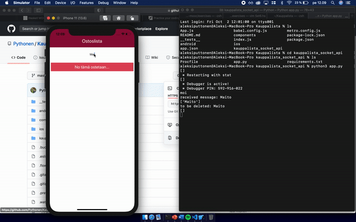

# Kauppalista

This is KauppaLista! My first React Native app. It's purpose is to work as a interactive shopping list, hence it's using sockets.
To get frontend running, firstly
```
npm i && npm i react-native-cli
```
if you have Apple device and Xcode installed, you can then in the terminal say
```
react-native run-ios
```


## Note 
that I developed this using **only** ios simulator. I have no clue what it is going to look like and how it is going to work with android version. 

To get backend running, cd into backend folder and then: 
```
pip3 install -r requirements.txt
```

and after that by running 
python3.py
you should have the backend running

TODO: 
* Backend to heroku or equivalent so one could really use this while shopping :D
* Make it scalable. Some friends wants this too now. 
* Since Apple is taking 100$ per year for publishing to app store, thus should make it PWA( and landing page maybe ) to avoid those expenses.
* Database. NoSQL or SQL? Currently, it would just save the groceries to servers memory since it's just a proof-of-consept

## Demonstration
Frontend on the left side and flask/socketio server on the right side.

